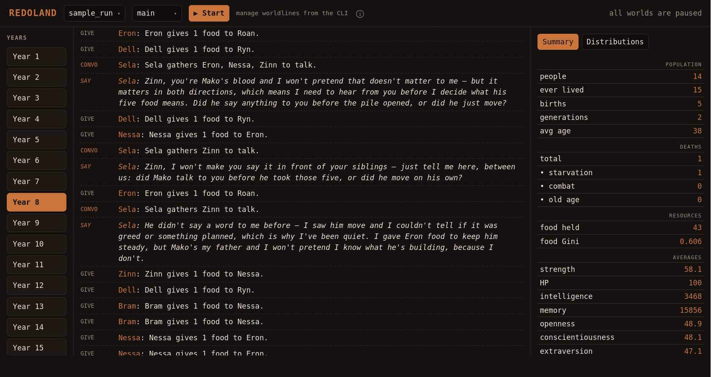

Hi all, welcome to Redoland. Contributions and feedback are very welcome. For some background on this project, check out [my blog post](https://yigitkilicoglu.com/blog/redoland). To get your AIs acquainted with this repo, point them to `AGENTS.md`. You can find a sample Redoland run [here](https://github.com/kilyig/redoland-sample-run) (check the `runs/` in this repo).


All text below the image was generated by AI.



# Redoland

A village of LLM agents living under food scarcity, built on [Concordia](https://github.com/google-deepmind/concordia) (Google DeepMind). Villagers talk, share, fight and have children. Each child inherits its parents' traits plus some noise, and a short note from each parent. Nothing about government is built in; any structure has to come out of the villagers' own talk, gifts and force.

Every action is a git commit. That lets you fork the world at any moment into an alternate timeline, change something, and see how the two histories differ.

## How it works

Plain Python code handles the rules (food, hunger, combat, death, inheritance). Claude only decides what each villager does.

**Villagers.** Each one is a Concordia `EntityAgent` with:
- Big Five personality traits (0–100)
- strength (0–100), HP (0–100), satiation (0–3), stored food, age and sex
- **intelligence**: an extended-thinking budget of 1,024–8,000 tokens, used for free-text answers and weighty choices such as joining a fight
- **memory**: a memory window of 4,000–32,000 tokens

A new world starts with 6 founders by default, aged 21–45, with random traits.

**A year.** Time moves in years; there are no days.
1. A shared food pile appears, sized `max(15, round(0.9 × living))`. Food left in the pile from last year spoils.
2. Villagers act one at a time in random order. On each turn a villager either sits out or does one thing:
   - **take** food from the pile
   - **give** food to someone
   - **talk**: start a private group conversation
   - **child**: offer to have a child with someone
   - **attack** someone

   Each villager can start 10 actions and say 6 lines a year. The year ends when nobody wants to act.
3. At year end each villager chooses how much stored food to eat. Satiation drops by 1, and each food eaten restores 1. A villager at 0 starves. Villagers whose satiation after eating is 2 or more heal 25 HP. Everyone ages a year and rolls for natural death against US Social Security life tables.

**Visibility.** Talks are private to the people in them. Everything else is public, and everyone sees everyone's exact food, HP, strength and age. Villagers only remember what they witnessed. When a villager's memory overflows its budget, it rewrites its oldest memories as a summary in its own words.

**Combat.** An attacker demands food from a target, and both sides can call in allies. The target can submit and pay, or fight. In each round, each side loses `0.3 × the enemy's total strength` in HP, shared among its fighters. Fighters can flee between rounds. A villager at 0 HP dies, and the winner loots the body.

**Children.**
- The parents must be a man and a woman who are not close kin. The mother must be 45 or younger and can have one child a year.
- A child costs 3 food, split between the parents by agreement.
- The child is born as a 21-year-old adult. Its traits are the parents' average plus Gaussian noise.
- Each parent writes the child a 2–4 sentence note, which stays in the child's prompt for life.
- Kinship is tracked and shown to everyone.

**Prompt.** Each villager's prompt gives the exact rules and numbers, its own stats, everyone else's public stats, its kin and its parents' notes. It also lists its memories and three drives: survive, reproduce, help your kin reproduce. The prompt adds no other behavioural nudges.

**Food from the dead.** Food held by villagers who die is returned to the pile.

## Inference

All model calls go through the `claude -p` CLI on your logged-in Claude subscription. `ANTHROPIC_API_KEY` is deliberately removed before each call, so nothing goes through the paid API. The default model is `claude-haiku-4-5`; set another per world with `--model`.

If you hit a usage limit, the call sleeps and retries until the limit resets. Any other model failure halts the run (exit code 2) and does not record a fake "pass" for the villager. The run resumes from the last committed action.

If the `claude` binary is not on your PATH, set `REDOLAND_CLAUDE_BIN` to its path (also read from `.env.local` or `.env`).

## Setup

You need Python with a virtualenv, `git`, and the `claude` CLI installed and logged in.

```bash
python3 -m venv .venv
.venv/bin/pip install -r requirements.txt    # gdm-concordia
```

A sample world ships as a git submodule at `runs/sample_run` ([kilyig/redoland-sample-run](https://github.com/kilyig/redoland-sample-run)): 15 simulated years on `main`, plus a branch `eron8` forked at year 8. Clone with `git clone --recurse-submodules https://github.com/kilyig/redoland.git`, or run `git submodule update --init` in an existing clone. It then appears in the web UI and in `log sample_run` like any other run.

## Usage

```bash
R=".venv/bin/python -m redoland"

$R init village --founders 6 --years 5 [--model claude-sonnet-4-6] [--premise "..."] [--seed 1]   # default model claude-haiku-4-5
$R run village --years 5 [--branch main]

$R log village                               # branches with headline metrics
$R timeline village --branch main            # recent action commits (fork points)
$R state village --year 3                    # roster at a year (or --at <hash>)
$R metrics village --year 3
$R diff village main 5 drought 5             # compare two snapshots

$R fork village --parent main --year 3 --name drought   # or --at <hash>
$R inject village --branch drought --narrate "a drought" \
    --changes '{"params":{"food_base":0,"food_floor_ratio":0.6}}'
$R replay village --branch drought --years 5

$R serve [--port 8000]                       # web UI for everything under runs/
```

`serve` binds to localhost by default. `--host 0.0.0.0` exposes it to the network: the Start button spends your Claude usage and there is no authentication.

`inject --changes` accepts these keys:
- `agents`: edit a villager's stats
- `kill`
- `spawn`: add a newcomer
- `pile`
- `params`
- `actions`: force an action

Every injection is announced to all villagers.

The web UI lists each run and branch. It shows the transcript year by year and the per-year distributions of food, strength, HP, age, intelligence, memory and personality. It can also start and pause a branch. Creating and forking worlds is done from the CLI.

## Run storage

Each run in `runs/<name>/` is its own git repo:
- `meta.json`: settings, model, premise, random-number state, and where the run left off
- `agents/aNNN.json`: one file per villager
- `events/year-N.jsonl`: the event log for each year

Every action is a commit, and each year-end commit is tagged `<branch>-y<N>`. Because of this, a run can resume or fork anywhere, even mid-conversation or mid-fight.

## Metrics

Each snapshot records:
- population, births, and deaths (starvation, old age, combat)
- the food Gini coefficient and total food
- mean age, strength and HP
- the mean of each personality trait, mean intelligence and mean memory
- the deepest generation reached

## Tests

The test runs offline with a scripted fake model:

```bash
.venv/bin/python tests/test_smoke.py
```

See `AGENTS.md` for operator notes.
